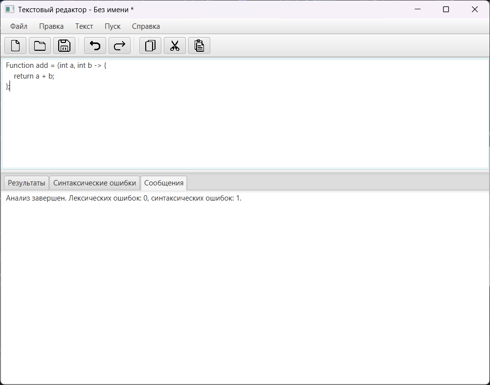
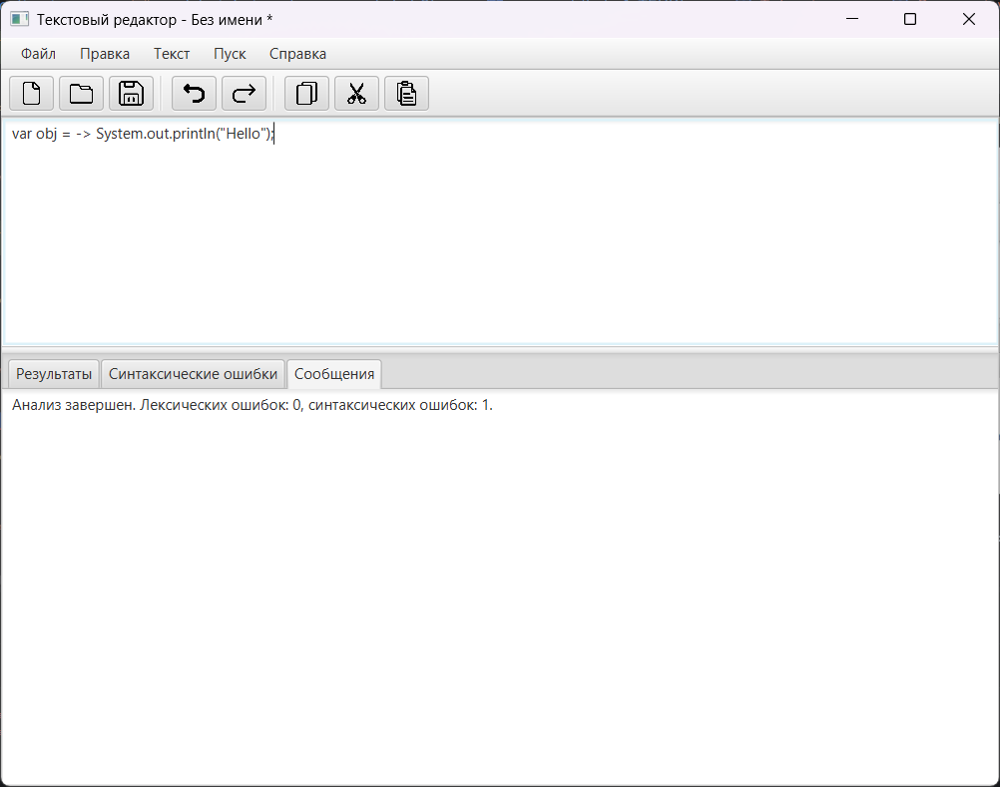
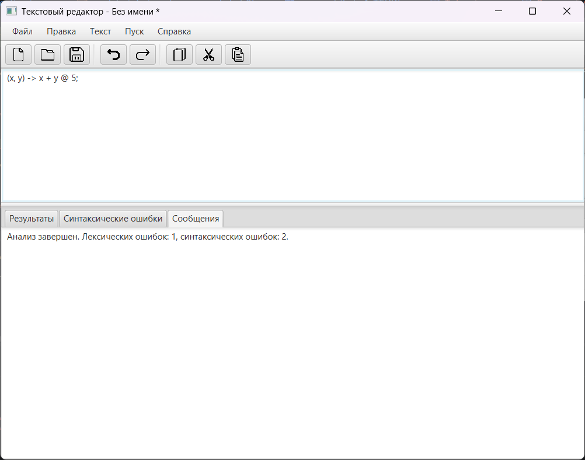

# Лабораторная работа: Разработка лексического и синтаксического анализатора

## 1. Название и цель лабораторной работы
**Название:** Разработка синтаксического анализатора (парсера)

**Цель работы:** 
Изучить назначение и принципы работы синтаксического анализатора 
в структуре компилятора. Спроектировать грамматику, построить 
соответствующую схему метода анализа грамматики и выполнить 
программную реализацию парсера с нейтрализацией синтаксических 
ошибок методом Айронса. Интегрировать разработанный модуль 
в ранее созданный графический интерфейс языкового процессора.
---

## 2. Сведения об авторе
* **ФИО:** Гусейнов Р.А.
* **Группа:** АВТ-314

---

## 3. Постановка задачи

Разработать синтаксический анализатор (парсер) в соответствии
с индивидуальным вариантом курсовой (расчетно-графической) 
работы, интегрировать его в приложение из лабораторной работы №1
и обеспечить наглядный вывод результатов анализа.

---

## 4. Вариант задания
**Тема:** Лямбда-выражения языка Java.

**Примеры корректных входных строк:**
1. `(int x, int y) -> { return x + y; };` (С полным определением типов и блоком тела)
2. `Function mult = x -> x * 2;` (Присваивание, один параметр без скобок, выражение в теле)
3. `var obj = () -> System.out.println("Hello");` (Присваивание, без параметров, с вызовом метода)

**Перечень допустимых лексем:**
* **Ключевые слова:** `int`, `double`, `float`, `boolean`, `char`, `byte`, `short`, `long`, `var`, `void`, `return`, `String`, `new`, `const`
* **Идентификаторы:** Последовательности из букв, цифр, `_` и `$`, начинающиеся не с цифры.
* **Числа:** Целые (`123`) и вещественные (`45.67`)
* **Строковые литералы:** Ограничены двойными или одинарными кавычками (`"text"`, `'text'`)
* **Лямбда-оператор:** `->`
* **Операторы:** `+`, `-`, `*`, `/`, `=`, `++`, `--`
* **Разделители:** `(`, `)`, `{`, `}`, `,`, `.`, `;`

---

## 5. Разработка грамматики
Грамматика спроектирована для разбора лямбда-выражений и адаптирована под LL(1) парсинг (без левой рекурсии).

**Полное определение грамматики:**
```text
Z -> LVal = Lambda | Lambda
LVal -> Type ID | ID
Lambda -> Params -> Body

Params -> ( ParamList ) | () | ID
ParamList -> Param ParamListTail
ParamListTail -> , Param ParamListTail | ε
Param -> Type ID | ID

Body -> { StmtList } | Expr
StmtList -> Stmt StmtList | ε
Stmt -> return Expr ; | Expr ; | Type ID = Expr ;

Expr -> Term ExprTail
ExprTail -> OP Term ExprTail | ε
OP -> + | - | * | / | =

Term -> ID | NUM | STR | ( Expr ) | MethodCall
MethodCall -> ID . ID ( Args )
Args -> Expr ArgsTail | ε
ArgsTail -> , Expr ArgsTail | ε
```
*(где ε — пустая цепочка / эпсилон)*

---

## 6. Классификация грамматики (по Хомскому)
Спроектированная грамматика является **контекстно-свободной грамматикой (КС-грамматикой)** (Тип 2 по иерархии Хомского). Правила вывода имеют вид `A -> α`, где $A$ — нетерминал, а $α$ — строка, состоящая из терминалов и/или нетерминалов. Грамматика приведена к LL(1) виду для парсинга слева направо.

---

## 7. Метод анализа
Алгоритм синтаксического анализа реализован **методом рекурсивного спуска** (нисходящий синтаксический анализ). 
Для каждого нетерминального символа грамматики (например, `parseLambda`, `parseExpr`, `parseBody`) написана отдельная программная функция. Эти функции рекурсивно вызывают друг друга в процессе разбора токенов по правилам грамматики.

---

## 8. Диагностика и нейтрализация синтаксических ошибок
Для нейтрализации ошибок реализован **метод Айронса (Panic mode / метод синхронизирующих токенов)**.
Если парсер ожидает определенный токен или структуру, но получает неверный токен, он фиксирует синтаксическую ошибку ("Ожидался идентификатор", "Ожидалось ')'") и переходит в режим восстановления: 
Программный парсер пропускает (игнорирует) токены входного потока до тех пор, пока не встретит один из **синхронизирующих токенов** из множества `Follow` для текущего контекста (например, `;`, `}`, `)` или `->`). После этого анализ возобновляется с известной безопасной позиции, что позволяет обнаруживать несколько ошибок в одном выражении без преждевременного падения программы.

---

## 9. Тестовые примеры

В данном разделе представлены примеры анализа корректных строк и строк с намеренными синтаксическими ошибками для проверки модуля нейтрализации (Panic Mode).

### Пример 1: Корректное выражение (присваивание лямбды)
**Код:**
```java
Function add = (int a, int b) -> {
    return a + b;
};
```
**Результат:** Лексический и синтаксический анализ прошли успешно. Ошибок нет.


### Пример 2: Синтаксическая ошибка (пропущена закрывающая скобка)
**Код:**
```java
Function add = (int a, int b -> {
    return a + b;
};
```
**Результат:** Парсер должен найти ошибку "Ожидалось ')'", после чего восстановиться на токене `->` и продолжить успешно парсить тело выражения `{ return a + b; };`.



### Пример 3: Отсутствие параметров у лямбды
**Код:**
```java
var obj = -> System.out.println("Hello");
```
**Результат:** Будет сообщено, что "Ожидались параметры лямбда-выражения" (ожидались `()`, `( ... )` или идентификатор). Восстановление после ошибки произойдет на токене `->`. 



### Пример 4: Использование лексически неверного символа
**Код:**
```java
(x, y) -> x + y @ 5;
```
**Результат:** Сканер зафиксирует лексическую ошибку "Недопустимый символ" на символе `@`. Синтаксический анализатор, поскольку он игнорирует токены с лексическими ошибками, корректно разберет часть `(x, y) -> x + y` как завершенное выражение. Встретив затем оставшийся токен `5`, парсер зафиксирует синтаксическую ошибку: *"Ожидался конец выражения, найдены лишние символы"*.

