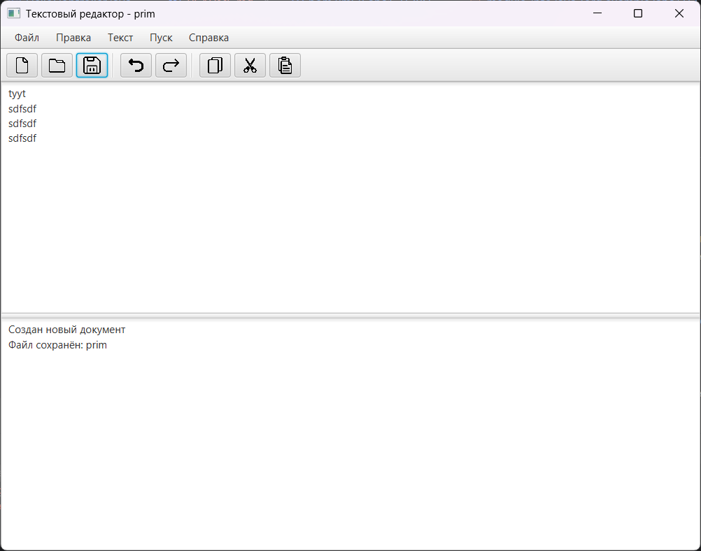

# Разработка пользовательского интерфейса (GUI) для языкового процессора

## Цель работы
Создание кроссплатформенного графического интерфейса (GUI) для языкового процессора в виде специализированного текстового редактора.


## Автор
**ФИО:** Гусейнов Рза Анар оглы  
**Группа:** АВТ-314  
**Учебное заведение:** НГТУ

---

## Описание проекта
Программа представляет собой компилятор с графическим интерфейсом, реализованный на Java с использованием JavaFX.  

Основные возможности приложения:
- Создание, открытие, сохранение и сохранение как файлов.
- Редактирование текста (копировать, вставить, вырезать, удалить, выделить всё, отменить/повторить).
- Изменение размера шрифта текста.
- Нижняя область для вывода сообщений программы (например, информация о сохранении или открытии файла).
- Быстрый доступ к функциям через меню, панель инструментов и горячие клавиши.
- Всплывающая справка по функционалу.
- Автоматическое предложение сохранить изменения при выходе из программы или открытии нового файла.

Дополнительные задания частично реализованы:
- Изменение размера текста в окне редактирования и области вывода результатов.
- Горячие клавиши для основных команд.
- Панель инструментов с кнопками для быстрого доступа к функциям.

---

## Используемые технологии

- **Язык программирования:** Java 23
- **GUI фреймворк:** JavaFX 17
- **Среда разработки:** IntelliJ IDEA / Apache Maven

---

## Инструкция по сборке и запуску

### Установка зависимостей
1. Установить [JDK 23](https://jdk.java.net/23/).
2. Установить [Apache Maven](https://maven.apache.org/).
3. Клонировать проект из репозитория или распаковать архив проекта.

### Сборка проекта
В терминале, находясь в корне проекта, выполнить:

```bash
mvn clean package jpackage:jpackage
```
## Основные элементы

Рис. 1 - Интерфейс приложения

### Меню

**Файл:**

- Создать (Ctrl+N) – создать новый документ.
- Открыть (Ctrl+O) – открыть существующий файл.
- Сохранить (Ctrl+S) – сохранить текущий файл.
- Сохранить как – сохранить файл под новым именем.
- Выход – закрыть программу с предложением сохранить изменения.

**Правка:**

- Отменить (Ctrl+Z), Повторить (Ctrl+Y)
- Вырезать (Ctrl+X), Копировать (Ctrl+C), Вставить (Ctrl+V)
- Удалить, Выделить всё (Ctrl+A)
- Увеличить/Уменьшить шрифт

**Текст:**

- Постановка задачи, Грамматика, Классификация грамматики, Метод анализа
- Тестовый пример, Список литературы, Исходный код программы

**Пуск:**

- Запуск анализатора

**Справка:**

- Вызов справки (открывает окно с описанием функций)
- О программе

---

### Панель инструментов

- Кнопки: Создать, Открыть, Сохранить, Undo, Redo, Копировать, Вырезать, Вставить
- Иконки для быстрого доступа, соответствуют функциям меню

---

### Область редактирования

- Основная TextArea для ввода текста.
- Поддерживает перенос текста и изменение размера шрифта.
- Выводит изменения в нижнюю область при создании/сохранении/открытии файла.

---

### Область вывода результатов

- TextArea, не редактируемая пользователем.
- Отображает информацию о действиях пользователя (например, “Файл сохранён: test.txt”).

---

### Горячие клавиши

- Ctrl+N – Новый файл
- Ctrl+O – Открыть файл
- Ctrl+S – Сохранить файл

---

### Ограничения

- Многовкладочный редактор пока не реализован (только один текстовый документ за раз).
- Интернационализация не реализована, интерфейс только на русском языке.
- Нумерация строк и подсветка синтаксиса не реализованы полностью.
- Drag & Drop открытия файлов не реализован.
- Отображение ошибок в виде таблицы пока отсутствует.  